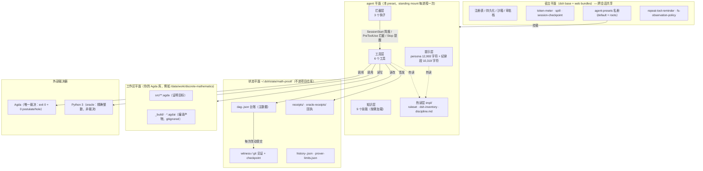
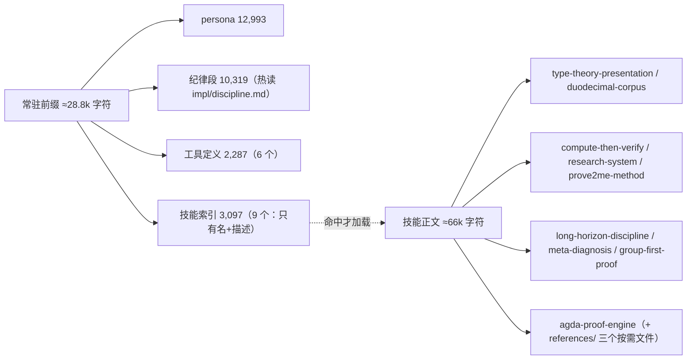

# M1 · 功能架构（平面 / 组件 / 职责）

> 这张图回答：**这套东西由哪些部分组成、每部分归谁管、边界在哪。**
> 事实来源：`agent.cordis.yml`（组合行）、`plugins/*.mjs`（注册的工具）、dsh 的宿主组合（`dsh --profile web --dump-config`）。

## M1.1 五个平面

| 平面 | 谁拥有 | 为什么在这一层 |
| --- | --- | --- |
| 宿主 | dsh 部署（`base` + `web` bundle） | 注册表、持久化、沙箱、审批是**跨会话**的；一个会话不能私占 |
| agent | 本 preset（`agent.cordis.yml` 37 行） | 工具/提示段/技能属于**单个 agent**；web 面故意禁用宿主里的同名行，交给 preset |
| 工作区 | 你的库 | 工具只读写，不改语义；`_build/` 与 `.agdai` 永远不进 git |
| 状态 | 工具自己（`~/.dsh/state/math-proof/`） | 台账不污染项目 `git status`；按工作区路径分桶 |
| 外部 | Agda / Python | **Agda 是唯一裁决**；Python 只做「先算后验证」的猜想生成与反例搜索 |

## M1.2 工具层：6 个工具的分工

| 工具 | 实现 | 它签发的**事实** | 它不做的事 |
| --- | --- | --- | --- |
| `proof_compile` | `plugins/agda-engine.mjs` | 编译**回执**（源码 sha256 + exit + 耗时 + 结果级失败指纹） | 不判断陈述对错 |
| `proof_oracle` | `plugins/python-oracle.mjs` | oracle **回执**（脚本哈希 + stdout 哈希 + `ORACLE-MANIFEST` 覆盖） | 不是证明，只反驳/支持猜想 |
| `proof_dag` | `plugins/proof-dag.mjs` | 持久化台账（节点/状态机/评测/知识图谱导出/`doctor` 自证） | 不产生证据，只记账与体检 |
| `proof_graph` | `plugins/proof-graph.mjs` | 静态 import DAG（拓扑序/环/未解析依赖） | 不读台账，纯看代码 |
| `prover_limits` | `plugins/prover-limits.mjs` | 工具链限制经验库（症状→判据→做法→**证据必填**） | 不替工具链背锅，只记录 |
| `proof_audit` | `plugins/proof-discipline.mjs` | 静态合规报告（红线/证据档位/回执状态） | 不编译、不改台账 |

## M1.3 提示层：常驻与按需

- 常驻只放**红线与判据**；领域知识、事故复盘、处方清单全部按需（见 `CACHE.md`）。
- 纪律段是**函数注册**，每次装配 prompt 重读 → 改纪律不用新开会话。

## M1.4 拦截层：3 个钩子

| 钩子 | 时机 | 行为 | 为什么在工具之外 |
| --- | --- | --- | --- |
| `hooks/session-start.mjs` | `SessionStart` | 注入接手简报（进度/评分/证据/对象完整度/待裁决） | 跨天接手时，模型还没开口就该知道现状 |
| `hooks/gate-dag.mjs` | `PreToolUse`（`proof_dag`） | 标 `proven` 而无回执、或依赖未 proven → **exit 2 拦截** | 工具内的校验可能被绕过（模型可以不调用工具），钩子在**调用前**挡 |
| `hooks/stop-reminder.mjs` | `Stop` | 有未验证/断链/待裁决时提醒收工写 `handoff` | 收工时刻最容易漏记 |

## M1.5 设计约束（改架构时必须守住）

1. **evidence 只能由工具签发**：模型写的 `evidence` 一律标未验证；
2. **preset 行不 provide service**（因此不需要 `isolate` realm）；要 provide 就得进 `isolate` 分组；
3. **工具文件只 import `node:` 内建**（`plugins/` 不在 harness 的 node_modules 走查范围内）；
4. **判定规则放 `impl/ruleset.mjs`**（热读），**结构/schema 改动属冷档**（需重挂载）；
5. **状态只写 `~/.dsh/state/math-proof/`**，不写项目仓库。

> 相关：`M2 依赖图`（谁 import 谁）、`M3 数据流`（一次任务的数据怎么走）、`M4 状态与数据管理`、
> `M5 会话生命周期`、`M6 证据链与反刷分`。
