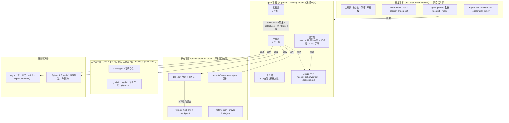
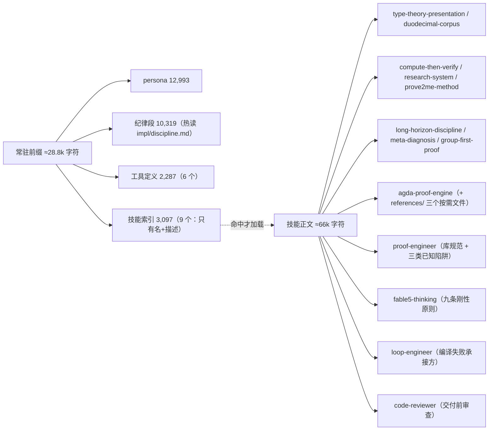
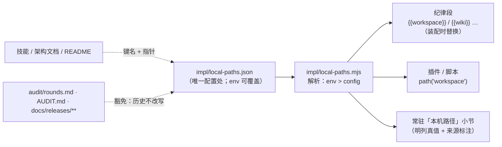

# M1 · 功能架构（平面 / 组件 / 职责）

> 这张图回答：**这套东西由哪些部分组成、每部分归谁管、边界在哪。**
> 事实来源：`agent.cordis.yml`（组合行）、`plugins/*.mjs`（注册的工具）、dsh 的宿主组合（`dsh --profile web --dump-config`）。

## M1.1 五个平面

| 平面 | 谁拥有 | 为什么在这一层 |
| --- | --- | --- |
| 宿主 | dsh 部署（`base` + `web` bundle） | 注册表、持久化、沙箱、审批是**跨会话**的；一个会话不能私占 |
| agent | 本 preset（`agent.cordis.yml` 37 行） | 工具/提示段/技能属于**单个 agent**；web 面故意禁用宿主里的同名行，交给 preset |
| 工作区 | 你的库 | 工具只读写，不改语义；`_build/` 与 `.agdai` 永远不进 git |
| 状态 | 工具自己（`~/.dsh/state/math-proof/`） | 台账不污染项目 `git status`；按工作区路径分桶 |
| 外部 | Agda / Python | **Agda 是唯一裁决**；Python 只做「先算后验证」的猜想生成与反例搜索 |

## M1.2 工具层：6 个工具的分工

| 工具 | 实现 | 它签发的**事实** | 它不做的事 |
| --- | --- | --- | --- |
| `proof_compile` | `plugins/agda-engine.mjs` | 编译**回执**（源码 sha256 + exit + 耗时 + 结果级失败指纹） | 不判断陈述对错 |
| `proof_oracle` | `plugins/python-oracle.mjs` | oracle **回执**（脚本哈希 + stdout 哈希 + `ORACLE-MANIFEST` 覆盖） | 不是证明，只反驳/支持猜想 |
| `proof_dag` | `plugins/proof-dag.mjs` | 持久化台账（节点/状态机/评测/知识图谱导出/`doctor` 自证） | 不产生证据，只记账与体检 |
| `proof_graph` | `plugins/proof-graph.mjs` | 静态 import DAG（拓扑序/环/未解析依赖） | 不读台账，纯看代码 |
| `prover_limits` | `plugins/prover-limits.mjs` | 工具链限制经验库（症状→判据→做法→**证据必填**） | 不替工具链背锅，只记录 |
| `proof_audit` | `plugins/proof-discipline.mjs` | 静态合规报告（红线/证据档位/回执状态） | 不编译、不改台账 |

## M1.3 提示层：常驻与按需

- 常驻只放**红线与判据**；领域知识、事故复盘、处方清单全部按需（见 `CACHE.md`）。
- 纪律段是**函数注册**，每次装配 prompt 重读 → 改纪律不用新开会话。

## M1.4 拦截层：3 个钩子

| 钩子 | 时机 | 行为 | 为什么在工具之外 |
| --- | --- | --- | --- |
| `hooks/session-start.mjs` | `SessionStart` | 注入接手简报（进度/评分/证据/对象完整度/待裁决） | 跨天接手时，模型还没开口就该知道现状 |
| `hooks/gate-dag.mjs` | `PreToolUse`（`proof_dag`） | 标 `proven` 而无回执、或依赖未 proven → **exit 2 拦截** | 工具内的校验可能被绕过（模型可以不调用工具），钩子在**调用前**挡 |
| `hooks/stop-reminder.mjs` | `Stop` | 有未验证/断链/待裁决时提醒收工写 `handoff` | 收工时刻最容易漏记 |
| `hooks/fable5-flow.mjs` | `UserPromptSubmit` + `Stop` | 多步新任务 → 注入「开工四项」（分解/拓扑扫描/多路径/落台账）；收工 → 注入「收工三项」（持久记忆/对抗自检/防虚假完成） | fable5 九步流程里**能拦截**的两步；短问句与纯应答不打扰 |

## M1.6 技能打包范围：只打「强关联 + 许可清晰」的

规则（用户 2026-09-10 定）：**公共仓库不是技能仓库**。只有同时满足两条的技能才随包分发——

1. **与数学证明强关联**（Agda 证明规范 / 类型论 / 离散结构 / 长程证明纪律 / 证据链）；
2. **许可清晰**（本项目原创，或上游明确开放共享并保留署名，见 `../THIRD-PARTY.md`）。

| 技能 | 随包？ | 依据 |
| --- | --- | --- |
| `agda-proof-engine`、`compute-then-verify`、`duodecimal-corpus`、`group-first-proof`、`long-horizon-discipline`、`meta-diagnosis`、`prove2me-method`、`research-system`、`type-theory-presentation` | ✅ | 本项目原创，且都是证明工作流的组成部分 |
| `proof-engineer` | ✅ | Agda 证明规范与三类已知陷阱（原为用户级技能，2026-09-10 起随包） |
| `code-reviewer` | ✅ | dype/Agda 审查、代数污染检测（同上） |
| `fable5-thinking` | ✅ | **第三方**（`THEBLUEGHOSTSSSS/Fable5-Thinking-Skill`，上游标注 MIT、作者开放共享）→ 保留署名与出处，见 `../THIRD-PARTY.md`。**注意它是「流程」不是纯知识**：上游只有 README + SKILL.md（无 hooks），九步闭环里能机械拦截的两步由本 preset 的 `hooks/fable5-flow.mjs` 承担 |
| `loop-engineer` | ❌ | **通用**技能（适用任何工程），不属本仓库范围；与证明强相关的部分**本地化**进 `agda-proof-engine` §5.9，其余引用写成**条件式** |

**引用纪律**：不在包里的技能，正文一律写「**若环境存在 `x` 技能则可…**」，绝不写成必需依赖；
必要时给出本仓库内的等效路径（如 §5.9 替代 `loop-engineer`）。`tests/skills-ref-check.mjs` 机械检查：
白名单技能的每一处提及都必须带条件语，且本机已装但未打包的技能名不得出现在操作性文件里。

### 适配政策（打包进来的技能怎么改）

| 改什么 | 为什么 |
| --- | --- |
| frontmatter 换 DSH 格式（`name` / `description` / `whenToUse` + 「不触发」清单） | 技能靠描述路由，缺 `whenToUse` 会与相邻技能抢触发 |
| harness 名词映射：`allowed-tools: read_file,…` → `read`/`edit`/`bash`/`grep`；`runAs: subagent` / `run_skill x "…"` → `subagent` 工具；`EnterPlanMode` → 计划模式；`/memory` → 台账 | 原写法在 DSH 里没有对应工具，照抄会让模型调用不存在的工具 |
| 删除/泛化作者本机路径 | 别人机器上不存在；保留语义的（如「技能文件不可变」）改成「任何技能根目录」 |
| 与其它技能重复的正文改成指针 | 两份副本必然漂移（`loop-engineer` 的附录曾与 `proof-engineer` §9 逐行重复 60 行） |

## M1.7 本机路径：唯一配置处 + 指针

- **为什么**：散落的绝对路径是死链来源（别人 clone 后指向不存在的地方）；也不该让「换机器」变成全库搜索替换。
- **怎么改**：只动 `impl/local-paths.json`，或用环境变量（`SOVEREIGN_REPO` / `SOVEREIGN_WIKI` / …）覆盖；env 优先。
- **可见性**：纪律段末尾会自动追加「本机路径」小节，明列每个键的**真值**与来源（`config` 还是 `env`）——
  模型看到的永远是本机实际值，而不是某个文件里的字符串。
- **强制**：`tests/paths-check.mjs`。操作性文件出现机器绝对路径即失败；历史与发布快照豁免但计数上报。

## M1.5 设计约束（改架构时必须守住）

1. **evidence 只能由工具签发**：模型写的 `evidence` 一律标未验证；
2. **preset 行不 provide service**（因此不需要 `isolate` realm）；要 provide 就得进 `isolate` 分组；
3. **工具文件只 import `node:` 内建**（`plugins/` 不在 harness 的 node_modules 走查范围内）；
4. **判定规则放 `impl/ruleset.mjs`**（热读），**结构/schema 改动属冷档**（需重挂载）；
5. **状态只写 `~/.dsh/state/math-proof/`**，不写项目仓库。

> 相关：`M2 依赖图`（谁 import 谁）、`M3 数据流`（一次任务的数据怎么走）、`M4 状态与数据管理`、
> `M5 会话生命周期`、`M6 证据链与反刷分`。
