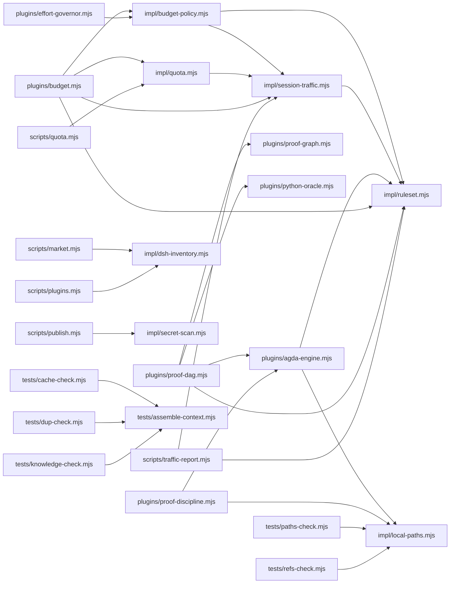

<!-- 本文件由 `scripts/docs-gen.mjs` 从源码生成，请勿手改。改动后跑 `node scripts/docs-gen.mjs` 重生成。 -->

# M2 · 依赖图（组合行 / 模块 / 外部包 / 数据文件）

> 生成源：`agent.cordis.yml` + `plugins/` `impl/` `tests/` `scripts/` 的源码。
> 漂移门禁：`node tests/docs-check.mjs`（不一致即失败）。

## M2.1 组合行（agent 平面）

共 **36** 行 = 外部包 **28** 条行（去重后 **25** 条 spec / **24** 个包） + 本地插件 **8** 个，另有 **3** 个分组。

| 行 id | 提供者 | 所属分组 | 状态 |
| --- | --- | --- | --- |
| `persona` | `@deepseek-ai/dsh-persona` | — | 启用 |
| `proof-discipline` | `./plugins/proof-discipline.mjs` | — | 启用 |
| `agda-engine` | `./plugins/agda-engine.mjs` | — | 启用 |
| `python-oracle` | `./plugins/python-oracle.mjs` | — | 启用 |
| `hooks` | `@deepseek-ai/dsh-hooks-claude-code` | — | 启用 |
| `proof-graph` | `./plugins/proof-graph.mjs` | — | 启用 |
| `proof-dag` | `./plugins/proof-dag.mjs` | — | 启用 |
| `prover-limits` | `./plugins/prover-limits.mjs` | — | 启用 |
| `budget` | `./plugins/budget.mjs` | — | 启用 |
| `effort-governor` | `./plugins/effort-governor.mjs` | — | 启用 |
| `agent-instructions` | `@deepseek-ai/dsh-agent-instructions` | — | 启用 |
| `tool-bash` | `@deepseek-ai/dsh-tool-bash` | — | 启用 |
| `tool-pwsh` | `@deepseek-ai/dsh-tool-pwsh` | — | 启用 |
| `tool-fs` | `@deepseek-ai/dsh-tool-fs` | — | 启用 |
| `tool-fs-search` | `@deepseek-ai/dsh-tool-fs-search` | — | 启用 |
| `tool-jobs` | `@deepseek-ai/dsh-tool-jobs` | — | 启用 |
| `skill-filesystem` | `@deepseek-ai/dsh-skill-filesystem` | — | 启用 |
| `tool-skill` | `@deepseek-ai/dsh-tool-skill` | — | 启用 |
| `command-goal` | `@deepseek-ai/dsh-command-goal` | — | 启用 |
| `tool-goal` | `@deepseek-ai/dsh-tool-goal` | — | 启用 |
| `planning` | **分组**（`cordis:group`） | — | 启用 |
| `plan-mode` | `@deepseek-ai/dsh-plan-mode` | `planning` | 启用 |
| `compaction` | **分组**（`cordis:group`） | — | 启用 |
| `compaction-basic` | `@deepseek-ai/dsh-compaction-basic` | `compaction` | 启用 |
| `command-compact` | `@deepseek-ai/dsh-command-compact` | `compaction` | 启用 |
| `tool-result-pruner` | `@deepseek-ai/dsh-compaction-tool-result-pruner` | `compaction` | 启用 |
| `delegation` | **分组**（`cordis:group`） | — | 启用 |
| `tool-subagent-control` | `@deepseek-ai/dsh-tool-subagent-control` | `delegation` | 启用 |
| `tool-subagent-list-agents` | `@deepseek-ai/dsh-tool-subagent-control/list-agents` | `delegation` | 启用 |
| `tool-subagent` | `@deepseek-ai/dsh-tool-subagent` | `delegation` | 启用 |
| `tool-subagent-fork` | `@deepseek-ai/dsh-tool-subagent` | `delegation` | 启用 |
| `tool-subagent-codex` | `@deepseek-ai/dsh-tool-subagent` | `delegation` | 禁用 |
| `tool-subagent-claude-code` | `@deepseek-ai/dsh-tool-subagent` | `delegation` | 禁用 |
| `workflow-worker-thread` | `@deepseek-ai/dsh-workflow-worker-thread` | `delegation` | 启用 |
| `tool-workflow` | `@deepseek-ai/dsh-tool-workflow` | `delegation` | 启用 |
| `tool-ralph` | `@deepseek-ai/dsh-tool-ralph` | `delegation` | 启用 |
| `tool-ask-user` | `@deepseek-ai/dsh-tool-ask-user` | — | 启用 |
| `tool-todo` | `@deepseek-ai/dsh-tool-todo` | — | 启用 |
| `tool-web` | `@deepseek-ai/dsh-tool-web` | — | 启用 |

## M2.2 模块依赖图

- 有出边的模块（**核心层**）：`impl/budget-policy.mjs`、`impl/quota.mjs`、`impl/session-traffic.mjs`、`plugins/agda-engine.mjs`、`plugins/budget.mjs`、`plugins/effort-governor.mjs`、`plugins/proof-dag.mjs`、`plugins/proof-discipline.mjs`、`scripts/market.mjs`、`scripts/plugins.mjs`、`scripts/publish.mjs`、`scripts/quota.mjs`、`scripts/traffic-report.mjs`、`tests/cache-check.mjs`、`tests/dup-check.mjs`、`tests/knowledge-check.mjs`、`tests/paths-check.mjs`、`tests/refs-check.mjs`
- 无出边的模块（**叶子/独立**）：`plugins/budget.mjs`、`plugins/effort-governor.mjs`、`plugins/proof-dag.mjs`、`plugins/proof-discipline.mjs`、`plugins/prover-limits.mjs`、`scripts/cache-report.mjs`、`scripts/check-all.mjs`、`scripts/docs-gen.mjs`、`scripts/lint-schemas.mjs`、`scripts/market.mjs`、`scripts/plugins.mjs`、`scripts/publish.mjs`、`scripts/quota.mjs`、`scripts/reload.mjs`、`scripts/state-gc.mjs`、`scripts/traffic-report.mjs`、`tests/benchmark.mjs`、`tests/budget-check.mjs`、`tests/cache-check.mjs`、`tests/docs-check.mjs`、`tests/dup-check.mjs`、`tests/eval-check.mjs`、`tests/hooks-check.mjs`、`tests/hot-section-check.mjs`、`tests/inject-check.mjs`、`tests/knowledge-check.mjs`、`tests/market-check.mjs`、`tests/paths-check.mjs`、`tests/plugins-check.mjs`、`tests/prompt-vars-check.mjs`、`tests/publish-check.mjs`、`tests/refs-check.mjs`、`tests/reload-check.mjs`、`tests/routing-check.mjs`、`tests/ruleset-check.mjs`、`tests/run.mjs`、`tests/skills-ref-check.mjs`

> 依赖方向即「谁可以 import 谁」：`plugins/` 是注册层（薄），`impl/` 是可热读共享层，
> `tests/` 与 `scripts/` 只消费、不被消费（所以它们不会出现在别人的 import 里）。

## M2.3 外部依赖

| 模块 | node 内建 | 外部包 |
| --- | --- | --- |
| `impl/budget-policy.mjs` | `node:fs` `node:path` | — |
| `impl/dsh-inventory.mjs` | `node:fs` `node:child_process` `node:path` `node:os` | — |
| `impl/local-paths.mjs` | `node:fs` `node:path` `node:url` | — |
| `impl/quota.mjs` | `node:fs` `node:path` | — |
| `impl/ruleset.mjs` | `node:crypto` `node:fs` `node:url` | — |
| `impl/session-traffic.mjs` | `node:crypto` `node:fs` `node:os` `node:path` `node:zlib` | — |
| `plugins/agda-engine.mjs` | `node:crypto` `node:fs` `node:os` `node:path` | — |
| `plugins/proof-dag.mjs` | `node:crypto` `node:fs` `node:url` `node:os` `node:path` | — |
| `plugins/proof-discipline.mjs` | `node:fs/promises` `node:fs` `node:path` | — |
| `plugins/proof-graph.mjs` | `node:fs` `node:path` | — |
| `plugins/prover-limits.mjs` | `node:fs` `node:os` `node:path` | — |
| `plugins/python-oracle.mjs` | `node:crypto` `node:fs` `node:os` `node:path` `node:url` | — |
| `scripts/cache-report.mjs` | `node:child_process` `node:fs` `node:os` `node:path` `node:zlib` | — |
| `scripts/check-all.mjs` | `node:child_process` `node:path` | — |
| `scripts/docs-gen.mjs` | `node:fs` `node:path` `node:url` | — |
| `scripts/lint-schemas.mjs` | `node:fs` `node:url` `node:path` | — |
| `scripts/market.mjs` | `node:fs` `node:path` `node:os` `node:url` | — |
| `scripts/plugins.mjs` | `node:fs` `node:path` `node:url` | — |
| `scripts/publish.mjs` | `node:fs` `node:path` `node:url` | — |
| `scripts/quota.mjs` | `node:fs` | — |
| `scripts/reload.mjs` | `node:fs` `node:child_process` `node:path` | — |
| `scripts/state-gc.mjs` | `node:child_process` `node:fs` `node:os` `node:path` `node:crypto` | — |
| `tests/assemble-context.mjs` | `node:fs` `node:path` | — |
| `tests/benchmark.mjs` | `node:fs` `node:crypto` `node:os` `node:path` | — |
| `tests/budget-check.mjs` | `node:child_process` `node:fs` `node:os` `node:path` `node:zlib` | — |
| `tests/cache-check.mjs` | `node:crypto` `node:child_process` `node:path` | — |
| `tests/docs-check.mjs` | `node:fs` `node:child_process` `node:path` | — |
| `tests/dup-check.mjs` | `node:fs` `node:path` | — |
| `tests/eval-check.mjs` | `node:fs` `node:path` | — |
| `tests/hooks-check.mjs` | `node:child_process` `node:fs` `node:os` `node:path` `node:crypto` | — |
| `tests/hot-section-check.mjs` | `node:fs` `node:os` `node:path` | — |
| `tests/inject-check.mjs` | `node:fs` `node:path` | — |
| `tests/knowledge-check.mjs` | `node:fs` `node:path` | — |
| `tests/market-check.mjs` | `node:child_process` `node:fs` `node:os` `node:path` | — |
| `tests/paths-check.mjs` | `node:fs` `node:path` | — |
| `tests/plugins-check.mjs` | `node:child_process` `node:fs` `node:path` | — |
| `tests/prompt-vars-check.mjs` | `node:fs` `node:path` | — |
| `tests/publish-check.mjs` | `node:child_process` `node:fs` `node:os` `node:path` | — |
| `tests/refs-check.mjs` | `node:fs` `node:path` | — |
| `tests/reload-check.mjs` | `node:child_process` `node:fs` `node:path` | — |
| `tests/routing-check.mjs` | `node:fs` `node:path` | — |
| `tests/ruleset-check.mjs` | `node:child_process` `node:fs` `node:os` `node:path` `node:timers/promises` | — |
| `tests/run.mjs` | `node:crypto` `node:fs` `node:os` `node:path` | — |
| `tests/skills-ref-check.mjs` | `node:fs` `node:path` `node:os` | — |

## M2.4 工具 → 实现

| 工具 | 实现模块 |
| --- | --- |
| `proof_audit` | `plugins/proof-discipline.mjs` |
| `proof_compile` | `plugins/agda-engine.mjs` |
| `proof_dag` | `plugins/proof-dag.mjs` |
| `proof_dag` | `tests/budget-check.mjs` |
| `proof_dag` | `tests/budget-check.mjs` |
| `proof_dag` | `tests/hooks-check.mjs` |
| `proof_graph` | `plugins/proof-graph.mjs` |
| `proof_oracle` | `plugins/python-oracle.mjs` |
| `prover_limits` | `plugins/prover-limits.mjs` |

## M2.5 数据文件 → 写入者

状态目录：`~/.dsh/state/math-proof/`（**不写进项目仓库**；preset 目录下另有 `state/` 存市场快照与宿主组合 dump）。

| 数据文件 | 写入者 |
| --- | --- |
| `*.lock`（台账写锁，带 PID 存活探测） | `plugins/proof-dag.mjs`、`scripts/docs-gen.mjs` |
| `checkpoint-<ws-hash>.json`（见证检查点，仓库之外） | `plugins/proof-dag.mjs` |
| `dag-<ws-hash>.json`（命题台账，**主数据**） | `plugins/proof-dag.mjs` |
| `graph-<ws-hash>.{json,md}`（知识图谱导出，可重建） | `plugins/proof-dag.mjs` |
| `history-<ws-hash>.json`（评分历史，限 200 条） | `plugins/proof-dag.mjs` |
| `oracle-receipts/`（oracle 回执） | `plugins/python-oracle.mjs` |
| `receipts/`（编译回执 + `agg-*.json` 聚合索引） | `plugins/agda-engine.mjs`、`plugins/proof-dag.mjs` |
| `witness-<ws-hash>/`（独立 git 见证仓库） | `plugins/proof-dag.mjs` |

> 维护入口：`scripts/state-gc.mjs`（归档回执 / 重建聚合 / 压缩见证 / 清理图谱导出）。
