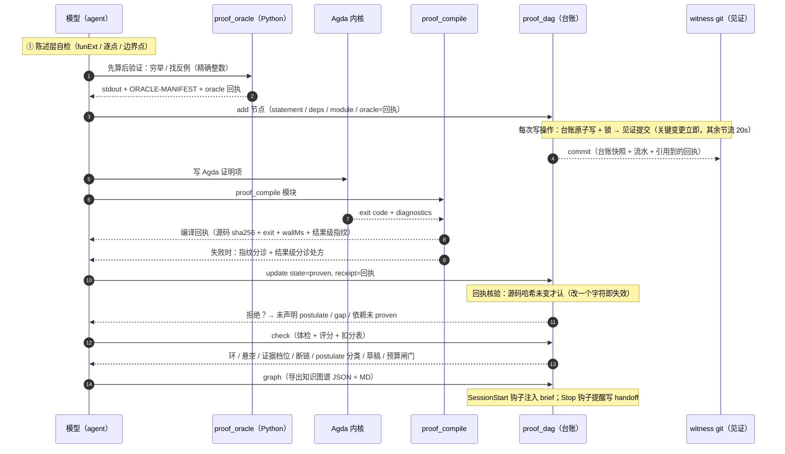
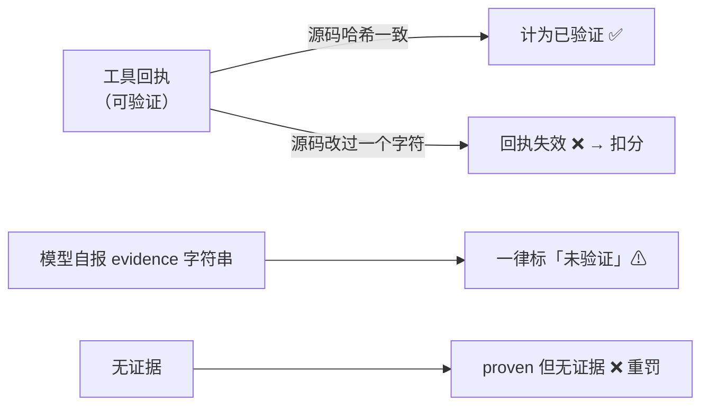
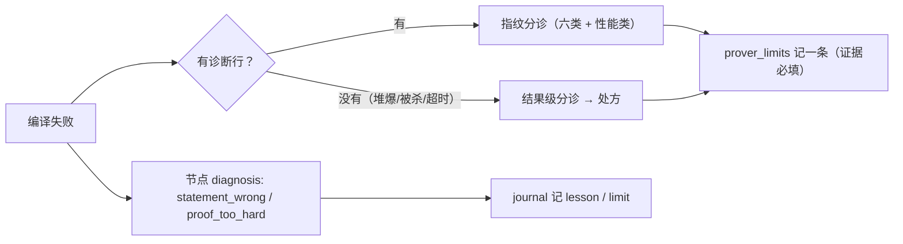

# M3 · 数据流（一次证明任务，从猜想到证据）

> 这张图回答：**一个命题从「想法」到「已证」经过哪些数据、每步留下什么、哪一步可能失效。**
> 事实来源：`plugins/proof-dag.mjs`、`plugins/agda-engine.mjs`、`plugins/python-oracle.mjs`、`hooks/*.mjs`。

## M3.1 主链路

## M3.2 每一步留下什么数据

| 步 | 产物 | 落在哪 | 可否重建 |
| --- | --- | --- | --- |
| 先算后验证 | oracle 回执（脚本哈希 + stdout 哈希 + 覆盖清单） | `state/math-proof/oracle-receipts/` | 否（重跑会得到新回执 id） |
| 编译 | 编译回执（源码 sha256 + exit + 耗时 + 指纹） | `state/math-proof/receipts/` | 否（重编译得到新回执，源码不变则内容一致） |
| 台账写 | 节点（statement/state/deps/证据引用/对象字段/postulate 分类） | `state/math-proof/dag-<ws>.json` | **否——这是主数据** |
| 见证 | git 提交（台账快照 + 流水） | `state/math-proof/witness-<ws>/` | 否（历史本身就是证据） |
| 体检 | 评分 + 扣分表 → 历史曲线 | `state/math-proof/history-<ws>.json` | 可（由台账重算） |
| 图谱导出 | `graph-<ws>.json`（带 `$schema`）+ `.md` | `state/math-proof/` | 可（由台账重建，**导出物可清理**） |
| 编译聚合 | `agg-<sha1>.json`（每模块累计次数/耗时） | `state/math-proof/receipts/` | 可（由全量回执重建） |
| 经验 | 限制条目（症状→判据→做法→证据） | `state/math-proof/prover-limits.json` | 否（人工经验） |

## M3.3 证据的三档与失效条件（数据流的诚信底线）

- **回执绑定源码哈希**：`proof_compile` 的回执与文件内容 sha256 绑定；**改文件即失效**（防「改文件冒充已证」）。
- **oracle 回执绑定脚本哈希 + stdout**：`points < domain` 判为抽样，**不算验证**（线性场上 `Δf ≡ 0` 会骗过你）。
- **见证 git 绑定历史**：删记录/回退提交会在 `check` 里以「历史被改写/提交数倒退」暴露。
  诚实边界：本地见证提高成本并留痕，**不等于不可篡改**（真不可篡改需要外部只追加日志）。

## M3.4 两条闸门在数据流里的位置

| 闸门 | 位置 | 触发后的动作 |
| --- | --- | --- |
| **先算后验证** | Agda 之前 | `points < domain` 或 oracle 不过 → **禁止开 Agda**，回退改陈述/算法 |
| **编译预算** | 同一模块累计失败 ≥3 次 | 停止逐条改错，**委托 `loop-engineer`**（`check` 与 `proof_compile` 都会打出 🛑） |
| **PreToolUse 拦截** | `proof_dag` 调用前 | 标 `proven` 无回执 / 依赖未 proven → **exit 2**，工具根本不执行 |
| **postulate 门禁** | 标 `proven` 时 | 模块里的 postulate 未逐个声明种类 → **拒收**；声明 `gap` → 拒收；`rewrite` 无 `{-# REWRITE #-}` 依据 → 拒收 |

## M3.5 失败时的数据流（诊断也是产出）

- `statement_wrong` = 陈述有误 → **改形式化**，不要硬证；
- `proof_too_hard` = 证明太难 → 拆子引理；
- 工具链限制（堆爆、沙箱拒绝、编译器传染性 flag）**不计入能力评价**，但必须记进 `prover_limits` / `journal(kind:"limit")`。

> 相关：`M4 状态与数据管理`（这些文件怎么管）、`M6 证据链与反刷分`（评分怎么算、什么算作弊）。
