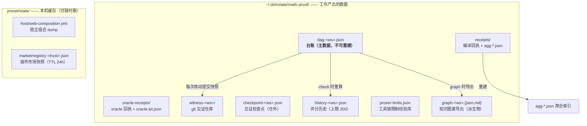

# M4 · 状态与数据管理（哪里存、活多久、怎么清）

> 这张图回答：**这些数据存在哪、哪个是主数据、哪个能重建、怎么清理才不丢东西。**
> 事实来源：`plugins/*.mjs` 的路径常量、`scripts/state-gc.mjs`（唯一维护入口）。
> 机器可读版（谁写哪类文件）见 `M2-dependency.md` §M2.5。

## M4.1 两个状态位置（别混）



| 位置 | 内容 | 进 git 吗 | 删了会怎样 |
| --- | --- | --- | --- |
| `~/.dsh/state/math-proof/` | 台账、回执、见证、历史、经验库、图谱导出 | ❌（`checkpoint` 在见证仓之外） | 台账删了 = **进度全丢**；其余可重建或有留档 |
| `<preset>/state/` | 宿主组合 dump、市场快照 | ❌（`.gitignore` 挡住；发布脚本也排除） | 下次运行自动重建（市场快照要联网，或用 `--offline` 报错） |
| 项目工作区 | `src/**.agda`、`_build/`、`*.agdai` | 你的库自己的规则 | 与 preset 无关；工具只读写 |

**按工作区路径分桶**：同一台机器上多个数学库共用一份状态目录，文件名带 `ws-hash`（sha1(路径) 前 12 位），互不干扰。

## M4.2 每类数据的生命周期

| 数据 | 生成时机 | 增长速度 | 策略 |
| --- | --- | --- | --- |
| 台账 `dag-<ws>.json` | 每次 `add/update/journal/import` | 与命题数线性 | **永不自动删**；`witness` 每次提交留快照 |
| 编译回执 `receipts/*.json` | 每次 `proof_compile`（成功与失败都记） | 与编译次数线性 | `--apply --archive-days N` 归档成 `archive/compile-YYYY-MM.jsonl`（**归档不删除**） |
| 聚合索引 `agg-*.json` | 回执写入时增量更新；缺失时全量重建 | 与模块数线性 | `--apply --rebuild-index` 重建（聚合与回执脱节时用） |
| oracle 回执 | 每次 `proof_oracle` | 与 oracle 次数线性 | 同回执归档策略 |
| 评分历史 `history-<ws>.json` | 每次 `check` | 代码内**限 200 条** | 自带上限，不需人工清 |
| 见证仓库 `witness-<ws>/` | 每次关键变更提交（其余 20s 节流合并） | git 对象累积 | `--apply --witness-gc`（`reflog expire` + `git gc`） |
| 知识图谱导出 `graph-*` | 每次 `action:"graph"` | **每次调用一组（json+md）** | `--apply --graph-keep N` 每 workspace 留最新 N 组，其余移到 `graph-archive/`（派生物，可重建） |
| 限制经验库 | `prover_limits add` | 人工 | 单文件，不自动清 |

## M4.3 维护入口（唯一）

```bash
node scripts/state-gc.mjs                                   # 只报告（dry-run，默认）
node scripts/state-gc.mjs --apply --archive-days 90         # 归档 90 天前的回执成 jsonl
node scripts/state-gc.mjs --apply --rebuild-index           # 用回执重建每模块聚合索引
node scripts/state-gc.mjs --apply --witness-gc              # 压缩见证仓库
node scripts/state-gc.mjs --apply --graph-keep 3            # 图谱导出瘦身（每 ws 留 3 组）
node scripts/state-gc.mjs --json                            # 机器可读
```

**原则：归档不删除。** 回执与图谱都进 `archive/` / `graph-archive/`，热目录瘦身但数据留档。

## M4.4 写安全：锁、原子写、损坏隔离

| 机制 | 实现 | 防的是什么 |
| --- | --- | --- |
| 写锁 | `dag-<ws>.json.lock`（含 PID 存活探测） | 并发 fan-out 下两个 agent 同时写、丢更新 |
| 原子写 | 先写 `*.tmp-<pid>` 再 `rename` | 写一半崩溃留下坏台账 |
| 损坏隔离 | 读到坏台账 → 改名 `*.corrupt-<ts>` 并**报错**（不静默重置） | 「悄悄清空台账」这种最坏情况 |
| 追加不覆盖 | 回执写进证据时**追加**，不覆盖人类写的反例说明 | 信息不丢 |
| 见证节流 | 非关键变更 20s 内合并；关键变更（init/journal/终态/诊断）立即提交 | 高频小改动撑爆见证仓库 |

## M4.5 备份与恢复（最小可靠方案）

```bash
# 备份：整个状态目录（台账 + 回执 + 见证一起走）
tar czf math-proof-state-$(date +%F).tgz -C ~/.dsh/state math-proof

# 只看某工作区的台账
node -e "const m=await import(process.env.HOME+'/.dsh/.agent-presets/math-proof/plugins/proof-dag.mjs');console.log(m.ledgerPath('工作区（见 `impl/local-paths.json`）'))" --input-type=module

# 恢复单条历史：见证仓库里每次关键变更都有一个 commit
git -C ~/.dsh/state/math-proof/witness-<ws> log --oneline | head
git -C ~/.dsh/state/math-proof/witness-<ws> show <commit>:dag.json | head
```

**诚实边界**：见证是**本地** git 仓库，有完全写权限的进程仍可连 `.git` 一起重写——
它提高成本、留下痕迹（`check` 会报「历史被改写 / 提交数倒退」），但**不等于不可篡改**。
真正的不可篡改需要外部只追加日志（尚未实现）。

## M4.5b 文件权限：dsh 写出来的**新文件是 0600**（2026-09-10 查实）

用户提醒「`engineering/tests/` 下两个脚本只有属主可读」→ 查下去，这不是那两个文件的事：

| 事实 | 证据 |
| --- | --- |
| dsh 的**文件工具**给**新建**文件落 **0600** | `@deepseek-ai/dsh-fs-local` 的 `writeFileAtomic`：暂存文件先 `chmod(0o600)`（`lib/index.js:484`），**只有目标已存在**时才 `chmod(existing.mode)` 回去（`:495`、调用点 `:791` 传的是 `existing?.mode` → 新文件是 `undefined`） |
| 复现 | 同一目录、同一 umask（0002）：`write` 工具建的文件 `-rw-------`，`bash` 重定向建的 `-rw-rw-r--`；编译器写的 `_build/*.agdai` 也是 `-rw-rw-r--` |
| 影响面（实测） | 会话工作区（本机 `discrete-mathematics` 克隆）里 **103 个仓库文件**是 0600（`src/` 60、`docs/` 32、`memory/` 5、`engineering/` 6）；本 preset 仓库 **83 个**（含本次新增的全部文件） |

**三种场景要分开看**（别把结论说错）：

| 场景 | 0600 有影响吗 | 为什么 |
| --- | --- | --- |
| 提交到 git → CI / 他人 clone | **没有** | git 只记 `100644`/`100755`，**不记**组/其他人的读写位；提交后检出即 0644（随检出方 umask） |
| 共享安装 / 直接把工作树拷给别人 | **有** | `cp -r`/`rsync` 不带 `--chmod` 会连权限一起搬 |
| 我们的**分发包**（`publish.mjs` + `tar`） | **曾有**，已修 | `cpSync` **保留**源权限 → 本地构建的分发包会带 0600；现在 `publish.mjs` 显式归一化（可执行位保留，其余 0644），`publish-check` 加两条断言钉死（去掉归一化即变红，已实测） |

修法：`find . -type f -exec chmod 664 {} +`（仓库侧）；`publish.mjs --dry-run` 会**顺带报出**本地树里还有多少个 0600 文件（信息性提示，不改变退出码）。

> 根因在 harness 的原子写实现，不在本 preset。彻底修需要改 `dsh-fs-local`（新文件应按 `0o666 & ~umask` 落权限）；
> 这属于上游改动，本 preset 只做**自己能做的那一半**：分发件归一化 + 门禁 + 文档写明。

## M4.5c 状态目录可覆盖（`MATH_PROOF_STATE_DIR`）——顺带修掉一个测试污染事故

状态目录（默认 `~/.dsh/state/math-proof`）原先在 `proof-dag` / `agda-engine` / `python-oracle` /
`prover-limits` 里**各自硬编码 `homedir()`**。2026-09-10 暴露出两个后果：

| 后果 | 实测 |
| --- | --- |
| **测试污染真实状态** | `tests/run.mjs` 的「编译热点」把假回执写进**用户真实回执目录**，并断言自己是「最贵的 3 条」 |
| **门禁在本机红、CI 绿** | 用户那边出现 **345.9s / 339.5s / 169.0s** 的真实编译回执 → 假回执（60s/30s）被挤出榜外 → 断言失败；CI 的状态目录是空的，所以永远是绿的 |

修法：**唯一实现** `impl/state-dir.mjs`（`stateDir()` / `statePath()`），优先读 `MATH_PROOF_STATE_DIR`，
未设置时回落到原来的 `~/.dsh/state/math-proof`（**生产行为逐字符不变**）；四个插件全部改走它。
随后 `tests/run.mjs` 与 `tests/hooks-check.mjs` 把**整份套件**（含进程内插件与派生钩子）的状态指向同一临时目录
——两处必须一致，否则「进程内写台账、钩子读临时目录」这类错位会让门禁红（踩过）。

门禁：`tests/paths-check.mjs` 新增 6 条——唯一实现存在、支持 env 覆盖、覆盖生效、默认回落、
**插件里不许再硬编码状态目录**、主套件确实做了隔离。

## M4.6 已知缺口（如实列出）

| 缺口 | 现状 | 影响 |
| --- | --- | --- |
| 图谱导出无自动上限 | 由 `--graph-keep` 手动清理（实测已有 68 个文件 / 65 组） | 体积小（0.2 MB），但会持续堆积 |
| 见证仓库无远程 | 只在本地 | 换机器要手动 `tar` 迁移 |
| 台账无 schema 版本迁移 | 字段只增不改语义 | 未来若改字段语义，需要写迁移脚本 |

> 相关：`M3 数据流`（谁写这些文件）、`M6 证据链`（回执如何失效）、`CACHE.md`（缓存前缀纪律）。
