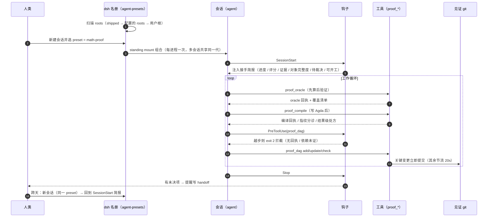
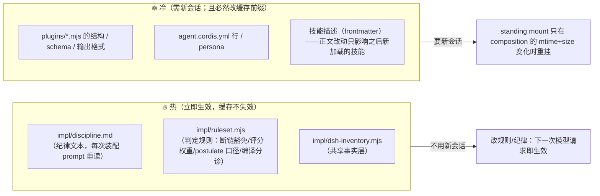

# M5 · 会话生命周期（从挂载到跨天接手）

> 这张图回答：**一次会话从哪开始、什么时候注入什么、上下文压缩后靠什么接上、改东西要不要新开会话。**
> 事实来源：`hooks/*.mjs`、`plugins/proof-dag.mjs`、`scripts/reload.mjs`、dsh 的 `dsh-agent-presets`。

## M5.1 生命周期全景

## M5.2 上下文压缩之后靠什么接上

| 承接物 | 内容 | 谁写 | 什么时候读 |
| --- | --- | --- | --- |
| **台账** `dag-<ws>.json` | 命题/状态/依赖/证据/对象字段 | 工具 | `brief` / `check` / `next` |
| **流水** `journal` | 决策、来源、限制、里程碑、教训、交接 | 模型 + 工具 | `brief` 列待裁决 |
| **见证 git** | 台账快照历史 | 工具 | `check` 核篡改 |
| **回执** | 编译 / oracle 证据 | 工具 | `check` 核证据档位 |
| **接手简报** `brief` | frontier / 卡点 / 待裁决 / 下一步 | 工具 | `SessionStart` 钩子自动注入 |

**核心事实**：长程记忆不在上下文里，**在台账与回执里**。压缩、重启、换天都不影响——
所以「压缩前赶紧写完」是错误策略，正确的是**随时把状态落进台账**。

## M5.3 热 / 可热 / 冷：改什么需要新开会话

**判断眼前这个会话跑的是哪版**：`proof_dag action:"doctor"` —— 报「插件本体 本实例 hash vs 磁盘 hash」
与「规则集 rN/hash」，并把「本会话启动后规则已变更」显式标出来。**引用分数前先跑它。**

运行 `node scripts/reload.mjs` 可看当前状态与逐档操作说明。

## M5.4 跨天/换人接手的标准动作

1. 收工前：`proof_dag journal` 写一条 `handoff`（今天到哪、明天从哪开始、卡在哪、等谁裁决）；
2. 新会话开起来：`SessionStart` 钩子自动注入 `brief`，**不要靠记忆复述**；
3. 先跑 `proof_dag action:"doctor"` 确认版本，再跑 `check` 看评分与扣分表；
4. `next` 拿可开工集合（依赖已 proven 的 pending），别从中间挑。

> 相关：`M1 架构`（组件边界）、`M3 数据流`（证据怎么来）、`CACHE.md`（缓存代价）、
> `scripts/reload.mjs`（逐档操作说明）。
