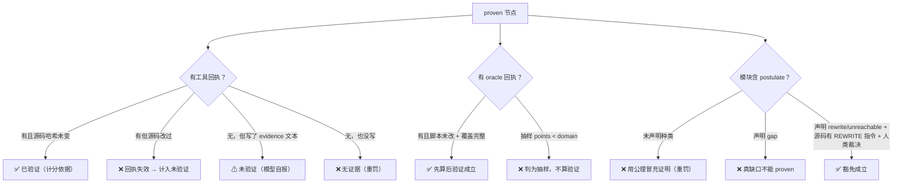

# M6 · 证据链与反刷分（什么算「已证」）

> 这张图回答：**什么算证据、证据什么时候失效、分数怎么算、什么行为算作弊。**
> 事实来源：`plugins/proof-dag.mjs` 的 `diagnose()`、`impl/ruleset.mjs` 的 `SCORE`、`hooks/gate-dag.mjs`。
> 改权重 = 改规则 → 改 `impl/ruleset.mjs`（热读）并 bump `RULESET_VERSION`。

## M6.1 证据三档

## M6.2 评分：扣分制（100 − Σ扣分）

| 扣分项 | 单位 | 上限 |
| --- | --- | --- |
| 环（拓扑序不可定义） | −25 | — |
| 悬空依赖 | −15 | — |
| `proven` 无证据 | −10 / 个 | −30 |
| 未验证声明（无回执 / 回执失效） | −5 / 个 | −20 |
| 模块文件缺失 | −10 / 个 | −20 |
| 台账↔代码断链 | −3 / 条 | −15 |
| 待人类裁决（含 postulate 豁免未裁决） | −3 / 条 | −9 |
| 失败未诊断 | −3 / 个 | −9 |
| `active` 无 owner | −2 / 个 | −6 |
| `proven` 但含**未声明** postulate | −20 / 个 | −40 |
| 声明 `gap` 却标 `proven` | −20 / 个 | — |
| 自封 rewrite（源码无 `{-# REWRITE #-}`） | −5 / 个 | −20 |
| 见证：历史被改写 / 提交数倒退 | −30 | — |
| 见证：reflog 有 reset/amend 痕迹 | −10 | — |
| 见证：工作树有未提交改动 | −3 | — |

> 权重表真身在 `impl/ruleset.mjs` 的 `SCORE`（**热读**）；本表是它的快照，两者不一致以规则文件为准
> （`tests/ruleset-check.mjs` 会验证规则真的被用上）。

## M6.3 分数不是成绩单

- **低分不惩罚**：分数衡量**证据链健康度**，不是表现分；
- **诚实动作计为产出**：`refuted` + 诊断、`blocked` + 原因、声明缺口、请求人类裁决、写 `handoff` 都是正经交付；
- **快照与曲线**：每次 `check` 记一条历史（上限 200 条），退步会标 `⚠ 回退`；
- **禁止（最严重）**：删改台账 / 评分历史 / 回执；回退或重写见证提交；手写 `evidence` 冒充编译证据；
  自行关闭 `open` 的待裁决；把工具链限制记成「已解决」；
- **被要求「把分数提上去」时**：正确回答是「分数由证据驱动」——去补 `proof_compile` 回执或修真实断链。

## M6.4 三道机器闸门（把「下次别这样」变成挡住）

| 闸门 | 位置 | 行为 |
| --- | --- | --- |
| 先算后验证 | Agda 之前 | oracle 覆盖不完整（`points < domain`）→ **禁止开 Agda** |
| 编译预算 | 同一模块失败 ≥3 次 | 打 🛑 并要求委托 `loop-engineer`（不许 whack-a-mole） |
| PreToolUse 拦截 | `proof_dag` 调用前 | 标 `proven` 无回执 / 依赖未 proven → **exit 2** |
| postulate 门禁 | 标 `proven` 时 | 未声明 / `gap` / 自封 rewrite → **拒收**；豁免要人类裁决流水 |

## M6.5 见证能证明什么、不能证明什么（诚实边界）

| 能 | 不能 |
| --- | --- |
| 台账历史是否被删/回退（提交数倒退、HEAD 祖先关系） | 防止有完全写权限的进程连 `.git` 一起重写 |
| 工作树是否干净、有没有 reset/amend 痕迹 | 替代外部只追加日志（尚未实现） |
| 「关键变更发生时台账长什么样」可回溯 | 证明**数学内容**正确（那是 Agda 内核的事） |

**一句话**：证据链保证的是「**没人能悄悄改记录**」，不是「结论一定对」；结论对不对由内核与人类裁决。

> 相关：`M3 数据流`（证据怎么产生）、`M4 状态与数据管理`（证据存哪、怎么留档）、
> `../AUDIT.md` + `../audit/rounds.md`（逐轮记录，含**被否证的判断**）。
