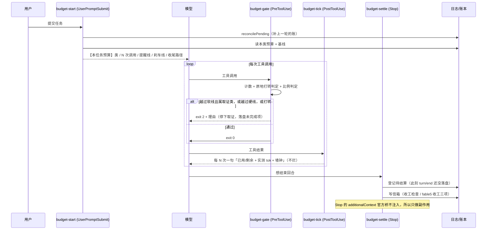
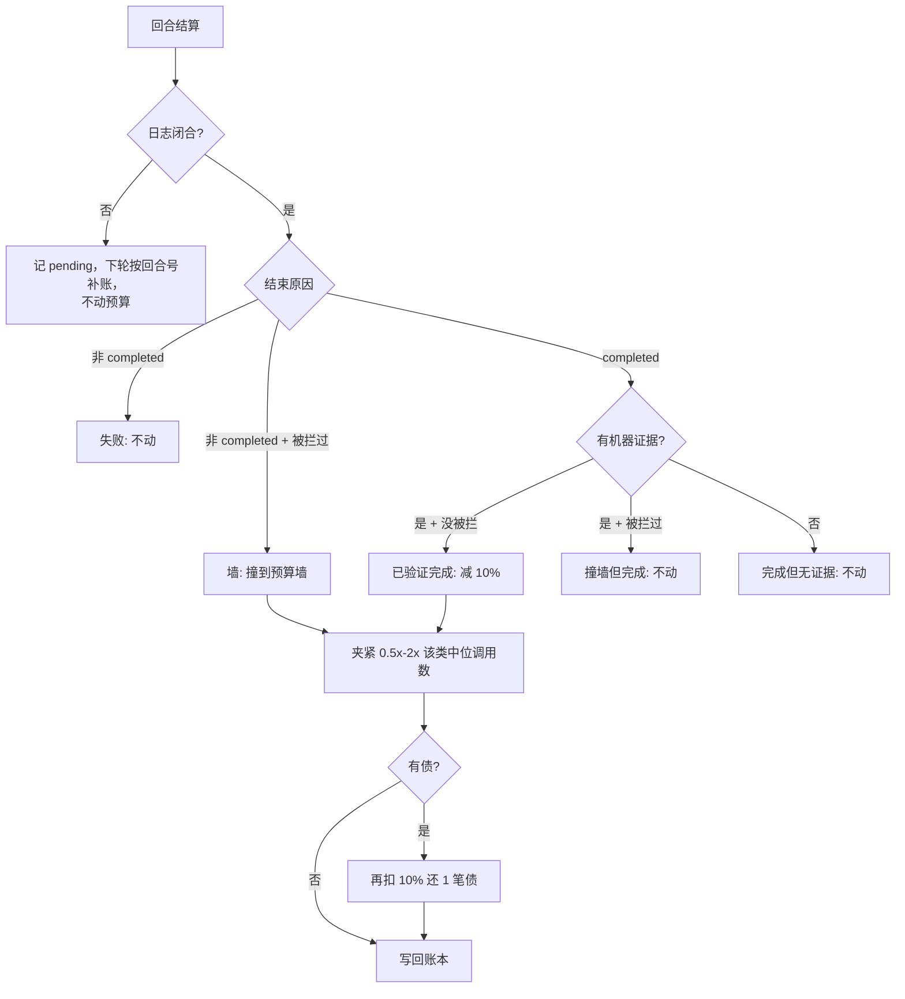

# M7 · 预算与流量（每次任务花多少、谁说了算）

> 读这一页之前：这是本 preset **唯一会主动拦下工具调用**的机制。出问题时先看
> [M7.7 状态文件](#m77-状态文件与数据管理) 与 [M7.8 开关](#m78-开关与调参)。

## 这一页回答三个问题

| 问题 | 答案（一句话） | 详见 |
| --- | --- | --- |
| 用**什么**评价每次任务的流量消耗？ | **工具调用次数**做主控量，`tok = Σ_step(input+cacheRead+output)` 做记账；按任务类取**中位数** | [M7.1](#m71-计量口径)、[M7.2](#m72-实测基线2026-09-10) |
| 预算能让模型**自己加减** 10% 吗？ | 能，但**不是自由旋钮**：加要申请 + 记债，减只在「已验证完成」时发生 | [M7.4](#m74-自适应算法与-10) |
| 「无限循环、烧流量」怎么挡？ | 两条：**原地打转检测**（同工具同参数）+ **两级刹车**（软线掐取证、硬线只留收尾） | [M7.5](#m75-刹车分级) |

## M7.1 计量口径

| 指标 | 定义 | 来源 | 为什么用它 |
| --- | --- | --- | --- |
| `calls` | 本回合**工具调用次数** | 钩子逐次计数（`PreToolUse`）；日志里由 `assistant/message` 的 `tool-call` 块计数复核 | 钩子能精确数、模型也能自己数——**能被双方观测的量才能当预算** |
| `steps` | 模型请求次数 | 日志 `assistant/message` 条数（每步一条） | 解释用；并行工具调用会让 `calls > steps` |
| `tok` | `Σ_step totalTokens` = `Σ(input + cacheRead + output)` | 日志 `assistant/message.usage`（与 `@deepseek-ai/dsh-token-meter` **同源**） | provider 真正计量的流量 |
| `ctxPeak` | 单步最大 `totalTokens` | 同上 | 流量的**乘数**（上下文越大，每步越贵） |
| `wallMs` | 回合墙钟 | `turn/start` → `turn/end` 时间戳 | 防「调用次数没超但一步卡很久」 |
| 证据 | **强**：回合时间窗内新落盘的 `receipts/` `oracle-receipts/` 文件；**弱**：工具结果里的高信号回执标记 | 文件系统 + 日志文本 | 「完成」要有机器证据才算数（[M6](M6-evidence-chain.md)） |

三条口径纪律：

1. **不是 token 做主控量**。实测单步上下文 40–80 万 token、99.6% 是 cacheRead——
   流量 ≈ **调用次数 × 每步上下文**；模型写出的字只占 0.9%，「少写字」几乎省不了流量。
2. **不用均值用中位数**。类内分布差 5.6 倍（p25 3.15M ↔ p90 17.63M），一个 84M 的失控回合
   足以把均值拉偏约 50%。
3. **先验与实测分开写**。代码里每类的预算是**先验**（标注「先验不是实测」）；
   实测值由 `budget action:"calibrate"` 或 `scripts/traffic-report.mjs --calibrate` 写进账本，
   样本 < 5 条的类**保留先验**——不为了「有数字」而编数字。

## M7.2 实测基线（2026-09-10）

数据源：本机 `~/.dsh/sessions/**/session.jsonl[.zstd]`，26 个会话 / 174 个有 usage 的回合。
原始数字可用 `node scripts/traffic-report.mjs` 现场复算。

| 指标 | p25 | 中位 | p75 | p90 | max |
| --- | --- | --- | --- | --- | --- |
| 单回合 tok | 3.15M | **6.61M** | 11.07M | 17.63M | 84.14M |
| 单回合步数 | — | **16** | — | 52 | 325 |
| 单回合墙钟（秒） | — | 111.7 | — | 398.1 | 2109.8 |

中位回合的构成：`input 8.2k` + `cacheRead` **6.58M** + `output` **14.2k**
⇒ **99.6% 的流量是上下文被重复读，模型输出只占 0.9%**。

由此定下的三件事：预算按**调用次数**报；提醒/刹车按**比例**分级；统计按**类**分组——
全局中位数对 5.6 倍的类间差异没有意义。

## M7.3 控制环

**关键顺序事实**：`Stop` 触发时 `turn/end` **尚未落盘**（桥要等所有 Stop 钩子放行才结束回合），
所以 Stop 只能登记「待结算 + 回合号」，真正的结算发生在**下一轮开局**（那时日志已闭合，
读到的是完整用量）。

## M7.4 自适应算法与 ±10%

一次回合结算后的判定（`classifyOutcome` + `adjustBudget`）：

三条纪律（这是「压力」有没有牙的关键）：

| 纪律 | 为什么 |
| --- | --- |
| **只有「已验证完成」才减 10%** | 没证据的「完成」不算数，否则模型靠缩小目标就能刷低预算 |
| **只有「撞到预算墙」才加 10%** | 失败/报错/中断**不加**——否则一个坏构建就能把预算养肥（棘轮） |
| **样本 < 5 条只记账不动手** | 数据不足时不动手，先验顶着跑（先验是保守估计，不是标定值） |

夹紧与记债：

- 预算永远夹在 `[0.5×, 2×]` 该类**实测中位调用数**之间（`BUDGET.clamp`）——棘轮在物理上到顶；
- 同一 workspace 的样本优先（不同仓库的任务形态差得远），不足 5 条才回退到全机样本，输出里标注口径；
- `topup` 追加：每任务限 1 次、理由 ≥ 20 字、批 `+50%`，并**记 1 笔债**——
  下个「已验证完成」的任务额外扣 10% 还债。想多花，先还。

## M7.5 刹车分级

`BUDGET` 里的阈值（相对本回合有效预算的倍数）：

| 触发 | 阈值 | 动作 |
| --- | --- | --- |
| 提醒 | `warnAt = 0.8×` | `PostToolUse` 附一句（不拦），每回合只念一次提醒 |
| 软刹车 | `softAt = 1.0×` | **取证类**工具（`read`/`glob`/`grep`/`bash`/`web_*`/`subagent`…）被拦 |
| 硬刹车 | `hardAt = 1.3×` | 除白名单外全拦（连 `edit`/`write` 也拦） |
| 墙钟 | 按类（默认 20 min，`chat` 3 min） | 按硬刹车处理 |
| 原地打转 | 同工具同参数第 **4** 次 | 拦（与预算无关，优先判） |

两条自我保护：

- **白名单永不被拦**：`budget` / `proof_dag` / `proof_oracle` / `todo_write` / `ask_user_question` / `skill` / `proof_graph`
  ——收尾与记账的路不能被预算掐断（门禁断言白名单与取证集**不相交**）。
- **一个回合最多拦 3 次**：拦多了本身就是流量（每次被拦仍要一次模型请求），之后放行，把处置权交还。

被拦的文案必须给出**唯一可执行的收尾路径**：`proof_dag journal` 落盘（已确立什么 / 未完成什么 / 下一步）+
`todo_write` 列缺口 + 需要就 `budget topup` 申请。**被拦不是失败**，信息只许收敛、不许丢。

## M7.6 投递点（哪个钩子能说话）

官方桥 `@deepseek-ai/dsh-hooks-claude-code` 的**硬约束**（源码 + 日志双重核对）：

| 事件点 | 能否把 `additionalContext` 交给模型 | 本 preset 用它做什么 |
| --- | --- | --- |
| `SessionStart` | ✅ `agent.inject(context)` | 接手简报 |
| `UserPromptSubmit` | ✅ 追加到本步 messages | 预算公告 + 信箱投递 + 补账 |
| `PreToolUse` | ❌ 只认 `deny` / `ask` | 预算闸门、计划绑定闸门 |
| `PostToolUse` | ✅ 追加到工具结果的 additionalContexts | 过程播报 |
| `Stop` | ❌ **只认 `deny`→`steer`（强行续跑）** | 只做副作用：登记待结算 + 写信箱 |

2026-09-10 的修正：原先 `stop-reminder.mjs` 在 Stop 上输出提醒，**从未进过模型上下文**
（日志里它的文本一次都没作为注入消息出现），已删除；内容搬进信箱，由下一轮开局念出来。
**不要在 Stop 里写 `additionalContext`，也不要在 Stop 里 deny**（后者会 steer 出新回合 = 流量翻倍）。

## M7.7 状态文件与数据管理

| 文件（`~/.dsh/state/math-proof/`） | 内容 | 生命周期 | 清理 |
| --- | --- | --- | --- |
| `budget-profile.json` | 学习账本：各类预算、最近样本（上限 400）、待结算、债务、开关、标定出处 | 跨天/跨会话/跨进程 | **不清理**（清了等于把学到的忘掉） |
| `budget-turn-<会话>.json` | 本回合实况：类、预算、已用、被拦次数、重复指纹表、墙钟起点 | 每回合覆盖重写 | 可安全删除 |
| `carryover-<workspace>.json` | 收工信箱：Stop 写入、下轮开局取空 | 取空即清 | 可安全删除 |
| `receipts/` `oracle-receipts/` | 回执（**强证据**） | 由 `proof_compile`/`proof_oracle` 签发 | 见 `state-gc.mjs` |

数据卫生：账本样本上限 `historyMax=400`（超出丢最旧）；重复指纹表上限 400 个键；
账本损坏 → **备份成 `.corrupt-<时间戳>`** 后返回空账本（不静默丢证据）；
一切写入都是 `tmp + rename` 原子写；测试全程用 `MATH_PROOF_STATE_DIR` 指到临时目录，
**绝不碰用户的真实账本**。

## M7.8 开关与调参

| 手段 | 效果 |
| --- | --- |
| `MATH_PROOF_BUDGET=off` | 完全关掉（不公告、不拦、不记账） |
| `MATH_PROOF_BUDGET=warn` | 只提醒不拦（**仍记账**，适合先观察几天） |
| `budget action:"off"` / `"on"` | 改账本 `enabled`（`off` 等同 `warn`） |
| `budget action:"status"` | 本回合实况：已用/剩余、日志实测 tok、墙钟、被拦次数、钩子错误 |
| `budget action:"report"` | 按类基线 + 最近结算（`scan:true` 顺带重扫全部日志现算） |
| `budget action:"calibrate"` | 用本机真实日志标定各类预算（`dryRun:true` 只算不写） |
| `impl/ruleset.mjs` 的 `BUDGET` | 所有阈值/先验/白名单/取证集/分类正则（**冷档**：改完要重启 dsh 进程） |
| `MATH_PROOF_STATE_DIR` / `MATH_PROOF_SESSIONS_ROOT` | 覆盖状态目录 / 会话日志根（测试与多机迁移用） |

## M7.9 已知边界（诚实清单）

- **先验不是实测**：五类任务的初始预算（4/16/16/20/30/38 次）是保守先验，
  真正生效的是 `calibrate` 之后的实测中位 × 1.25；样本不足时**故意不动手**。
- **分类是正则**：`classifyTask` 按关键词排序匹配，长提示词兜底到 `build`、短提示词兜底到 `chat`。
  误分类的后果是「预算给错类」，可在 `budget status` 里看到 `class` 并用 `classId` 显式指定。
- **token 只在结算时准**：过程播报里的 tok 来自「当前回合窗口」的日志读，读得慢会**自动降级**
  （`LIVE_BUDGET_MS`），此时只报调用次数与墙钟。
- **Stop 结算必然延后一轮**：`turn/end` 在 Stop 之后落盘，所以结算播报发生在**下一轮开局**。
- **需要 Node ≥ 22.15 / 23.8 才能读压缩日志**：`session.jsonl.zstd` 只能用 `node:zlib` 的 zstd 解。
  老 Node 上**能力是运行时探测的**（`ZSTD_SUPPORTED`）：不崩，`budget status` 会报「日志读取不可用」，
  调用次数计数与刹车照常，`tok`/步数缺失且不产生样本。**绝不要**写成命名导入
  `import { zstdDecompressSync } from 'node:zlib'`——那在 Node 20 是链接期 `SyntaxError`，
  会让整个 `plugins/budget.mjs` 挂不上（CI 的 Node 20 作业抓到过；`tests/budget-check.mjs` 有静态断言）。
- **尚未在有 dsh 进程的真实会话里端到端验证**：钩子脚本、判定、结算、投递契约都有 168 条门禁断言
  覆盖（`tests/budget-check.mjs`），但「钩子在真会话里被桥调用」这一步要等
  重启 dsh 进程 + 开一个 math-proof 会话后才算实测。
