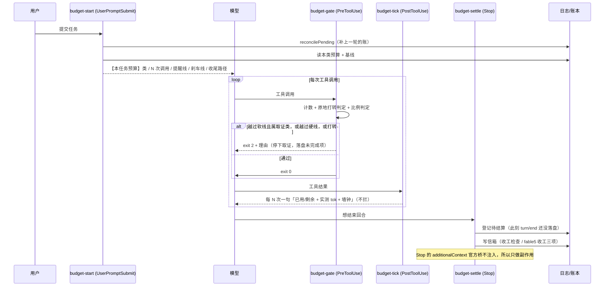
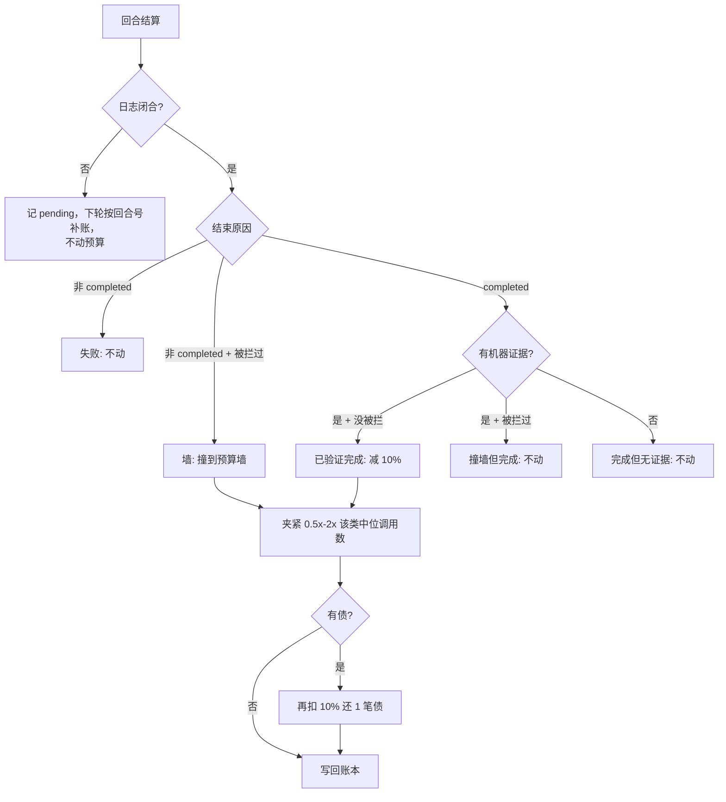
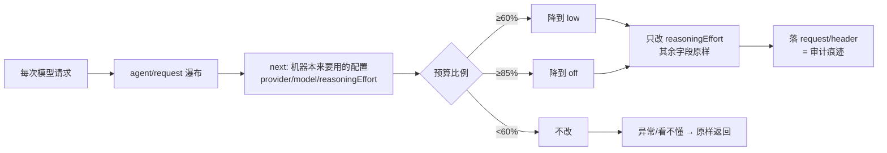

# M7 · 预算与流量（每次任务花多少、谁说了算）

> 读这一页之前：这是本 preset **唯一会主动拦下工具调用**的机制。出问题时先看
> [M7.7 状态文件](#m77-状态文件与数据管理) 与 [M7.8 开关](#m78-开关与调参)。

## 这一页回答三个问题

| 问题 | 答案（一句话） | 详见 |
| --- | --- | --- |
| 用**什么**评价每次任务的流量消耗？ | **工具调用次数**做主控量，`tok = Σ_step(input+cacheRead+output)` 做记账；按任务类取**中位数** | [M7.1](#m71-计量口径)、[M7.2](#m72-实测基线2026-09-10) |
| 预算能让模型**自己加减** 10% 吗？ | 能，但**不是自由旋钮**：加要申请 + 记债，减只在「已验证完成」时发生 | [M7.4](#m74-自适应算法与-10) |
| 「无限循环、烧流量」怎么挡？ | 两条：**原地打转检测**（同工具同参数）+ **两级刹车**（软线掐取证、硬线只留收尾） | [M7.5](#m75-刹车分级) |
| 能不能让模型**自动调节思考强度**？ | 能（`agent/request` 瀑布自动降档），但它**不是省流量的杠杆**——实测 reasoning 只占 0.12%，高思考回合反而更省 | [M7.6](#m76-思考强度自动调节实测否证了三个直觉) |
| 有没有**单次会话的 token 总预算**？ | 有（`SESSION` 表：默认 5e8，提醒 80%、硬线 100%）。⚠ 但「100 万 token 一次会话」在本负载下**不成立**：中位会话已 1.25M、**单个中位回合**就 6.61M | [M7.7](#m77-会话-token-预算跨回合的总闸) |
| 监控看什么？ | **token 的输入/输出分解**（跨 provider 通用，含 MiMo/Qwen 这类**积分制**）；「钱」只有 DeepSeek 这类余额制才有 | [M7.7a](#m77a-监控口径token-是主余额是特例)、[M7.7b](#m77b-余额余额监控官方给的是钱不是-token-配额) |

## M7.1 计量口径

| 指标 | 定义 | 来源 | 为什么用它 |
| --- | --- | --- | --- |
| `calls` | 本回合**工具调用次数** | 钩子逐次计数（`PreToolUse`）；日志里由 `assistant/message` 的 `tool-call` 块计数复核 | 钩子能精确数、模型也能自己数——**能被双方观测的量才能当预算** |
| `steps` | 模型请求次数 | 日志 `assistant/message` 条数（每步一条） | 解释用；并行工具调用会让 `calls > steps` |
| `tok` | `Σ_step totalTokens` = `Σ(input + cacheRead + output)` | 日志 `assistant/message.usage`（与 `@deepseek-ai/dsh-token-meter` **同源**） | provider 真正计量的流量 |
| `ctxPeak` | 单步最大 `totalTokens` | 同上 | 流量的**乘数**（上下文越大，每步越贵） |
| `wallMs` | 回合墙钟 | `turn/start` → `turn/end` 时间戳 | 防「调用次数没超但一步卡很久」 |
| 证据 | **强**：回合时间窗内新落盘的 `receipts/` `oracle-receipts/` 文件；**弱**：工具结果里的高信号回执标记 | 文件系统 + 日志文本 | 「完成」要有机器证据才算数（[M6](M6-evidence-chain.md)） |

三条口径纪律：

1. **不是 token 做主控量**。实测单步上下文 40–80 万 token、99.6% 是 cacheRead——
   流量 ≈ **调用次数 × 每步上下文**；模型写出的字只占 0.9%，「少写字」几乎省不了流量。
2. **不用均值用中位数**。类内分布差 5.6 倍（p25 3.15M ↔ p90 17.63M），一个 84M 的失控回合
   足以把均值拉偏约 50%。
3. **先验与实测分开写**。代码里每类的预算是**先验**（标注「先验不是实测」）；
   实测值由 `budget action:"calibrate"` 或 `scripts/traffic-report.mjs --calibrate` 写进账本，
   样本 < 5 条的类**保留先验**——不为了「有数字」而编数字。

## M7.2 实测基线（2026-09-10）

数据源：本机 `~/.dsh/sessions/**/session.jsonl[.zstd]`，26 个会话 / 174 个有 usage 的回合。
原始数字可用 `node scripts/traffic-report.mjs` 现场复算。

| 指标 | p25 | 中位 | p75 | p90 | max |
| --- | --- | --- | --- | --- | --- |
| 单回合 tok | 3.15M | **6.61M** | 11.07M | 17.63M | 84.14M |
| 单回合步数 | — | **16** | — | 52 | 325 |
| 单回合墙钟（秒） | — | 111.7 | — | 398.1 | 2109.8 |

中位回合的构成：`input 8.2k` + `cacheRead` **6.58M** + `output` **14.2k**
⇒ **99.6% 的流量是上下文被重复读，模型输出只占 0.9%**。

由此定下的三件事：预算按**调用次数**报；提醒/刹车按**比例**分级；统计按**类**分组——
全局中位数对 5.6 倍的类间差异没有意义。

## M7.3 控制环



**关键顺序事实**：`Stop` 触发时 `turn/end` **尚未落盘**（桥要等所有 Stop 钩子放行才结束回合），
所以 Stop 只能登记「待结算 + 回合号」，真正的结算发生在**下一轮开局**（那时日志已闭合，
读到的是完整用量）。

## M7.4 自适应算法与 ±10%

一次回合结算后的判定（`classifyOutcome` + `adjustBudget`）：



三条纪律（这是「压力」有没有牙的关键）：

| 纪律 | 为什么 |
| --- | --- |
| **只有「已验证完成」才减 10%** | 没证据的「完成」不算数，否则模型靠缩小目标就能刷低预算 |
| **只有「撞到预算墙」才加 10%** | 失败/报错/中断**不加**——否则一个坏构建就能把预算养肥（棘轮） |
| **样本 < 5 条只记账不动手** | 数据不足时不动手，先验顶着跑（先验是保守估计，不是标定值） |

夹紧与记债：

- 预算永远夹在 `[0.5×, 2×]` 该类**实测中位调用数**之间（`BUDGET.clamp`）——棘轮在物理上到顶；
- 同一 workspace 的样本优先（不同仓库的任务形态差得远），不足 5 条才回退到全机样本，输出里标注口径；
- `topup` 追加：每任务限 1 次、理由 ≥ 20 字、批 `+50%`，并**记 1 笔债**——
  下个「已验证完成」的任务额外扣 10% 还债。想多花，先还。

## M7.5 刹车分级

`BUDGET` 里的阈值（相对本回合有效预算的倍数）：

| 触发 | 阈值 | 动作 |
| --- | --- | --- |
| 提醒 | `warnAt = 0.8×` | `PostToolUse` 附一句（不拦），每回合只念一次提醒 |
| 软刹车 | `softAt = 1.0×` | **取证类**工具（`read`/`glob`/`grep`/`bash`/`web_*`/`subagent`…）被拦 |
| 硬刹车 | `hardAt = 1.3×` | 除白名单外全拦（连 `edit`/`write` 也拦） |
| 墙钟 | 按类（默认 20 min，`chat` 3 min） | 按硬刹车处理 |
| 原地打转 | 同工具同参数第 **4** 次 | 拦（与预算无关，优先判） |

两条自我保护：

- **白名单永不被拦**：`budget` / `proof_dag` / `proof_oracle` / `todo_write` / `ask_user_question` / `skill` / `proof_graph`
  ——收尾与记账的路不能被预算掐断（门禁断言白名单与取证集**不相交**）。
- **一个回合最多拦 3 次**：拦多了本身就是流量（每次被拦仍要一次模型请求），之后放行，把处置权交还。

被拦的文案必须给出**唯一可执行的收尾路径**：`proof_dag journal` 落盘（已确立什么 / 未完成什么 / 下一步）+
`todo_write` 列缺口 + 需要就 `budget topup` 申请。**被拦不是失败**，信息只许收敛、不许丢。

## M7.6 投递点（哪个钩子能说话）

官方桥 `@deepseek-ai/dsh-hooks-claude-code` 的**硬约束**（源码 + 日志双重核对）：

| 事件点 | 能否把 `additionalContext` 交给模型 | 本 preset 用它做什么 |
| --- | --- | --- |
| `SessionStart` | ✅ `agent.inject(context)` | 接手简报 |
| `UserPromptSubmit` | ✅ 追加到本步 messages | 预算公告 + 信箱投递 + 补账 |
| `PreToolUse` | ❌ 只认 `deny` / `ask` | 预算闸门、计划绑定闸门 |
| `PostToolUse` | ✅ 追加到工具结果的 additionalContexts | 过程播报 |
| `Stop` | ❌ **只认 `deny`→`steer`（强行续跑）** | 只做副作用：登记待结算 + 写信箱 |

2026-09-10 的修正：原先 `stop-reminder.mjs` 在 Stop 上输出提醒，**从未进过模型上下文**
（日志里它的文本一次都没作为注入消息出现），已删除；内容搬进信箱，由下一轮开局念出来。
**不要在 Stop 里写 `additionalContext`，也不要在 Stop 里 deny**（后者会 steer 出新回合 = 流量翻倍）。

## M7.6 思考强度自动调节（实测否证了三个直觉）

用户的原话是「防止模型的无限循环输出、浪费流量和**过度思考**；让模型自动调节思考强度」。
先量，再设计——**三条直觉里有一条成立、两条被自己的数据否掉**：

| 假设 | 实测（2026-09-10，176 个有 usage 的回合，`node scripts/traffic-report.mjs` 可复算） | 结论 |
| --- | --- | --- |
| 过度思考烧流量 | reasoning token 合计 **2.02M = 全部流量的 0.12%**（中位回合 0.078%，每步中位 350） | ❌ **否**（省不到） |
| 想得越多越贵 | 每步 reasoning ≥1000 的回合（n=20）：步数中位 **15.5**、tok 中位 **4.05M**；每步 <300 的回合（n=75）：**17 步 / 9.32M** | ❌ **否**（高思考回合反而更省） |
| 「无限循环输出」刷屏 | 159 个含长文本（≥300 字）的回合里，重复长文本块 **0 次** | ❌ 目前没这个现象（不建检测器） |
| 原地打转（同工具同参数反复调） | 存在但少：`repeatMax` 多为 1–2，个别 3–4；**重复结果**最长连续段中位 0、p90 2 | ✅ **成立且便宜**（保留既有检测） |
| 「无推进」（连续调用不写任何东西） | 中位连续 **11** 次、p90 **35**；而且 **50% 的回合整轮没有任何写入**（纯调查/阅读本来就是正经工作） | ❌ **否**（当刹车的阈值会天天误拦） |
| 流量真正的来源 | 99.6% 是上下文重复读 ⇒ 流量 ≈ **调用次数 × 每步上下文**；单回合 p90 17.6M vs max 84M | ✅ 成立 → **预算按调用次数**（[M7.4](#m74-自适应算法与-10)） |

所以本 preset 采取的是「**一建一测一拒**」：

- **建**（用户明确要的功能，且安全）：`agent/request` 瀑布调速器——预算过 60% 降到 `low`，
  过 85% 降到 `off`；任务结束**还原**到改之前那一档。定位坦白写清：**它不是省流量的旋钮，
  是「预算吃紧时强制收敛」的旋钮**（流量 ≈ 调用次数 × 上下文，真正决定花销的是还要跑多少轮）。
- **测**（让数据而不是立场决定）：报表与结算样本都记 `effortAtStart / effortLast`，
  `traffic-report` 出「思考强度 vs 消耗」分组表——攒够样本后**用你自己的数据**回答这个问题。
- **拒**（有实测支持才拒）：不给「无推进」加刹车、不建长文本重复检测器、不做「重复结果」熔断。
  理由写在 `audit/rounds.md §七十`，将来若数据变了可以据此重开。

### 控制流



### 安全纪律（六条，写进插件头注释并门禁钉死）

1. 先 `await next()` 拿机器配置，**只在它之上改一个字段**（键集不变，门禁断言）；
2. **只降不升**（降档 = 目标档序号更大）；绝不超过改之前那一档；
3. 看不到 `reasoningEffort`（部署关了思考 / 换适配器）或档位未知 → **不动**
   （DeepSeek 适配器只认 `off|low|high|max`，传别的会抛 `UNSUPPORTED_REASONING_EFFORT`）；
4. **还原**用 `effortBefore`（我们改之前的值），不去猜用户想要哪档；
5. `next()` 自己的异常**原样抛出**（吞掉会把「模型路由错误」变成莫名其妙的行为）；
6. 任何其它异常 → 返回机器原本的配置（**绝不因为调速让一次请求失败**）。

## M7.7a 监控口径：**token 是主，余额是特例**

DSH 不只对接 DeepSeek。MiMo / Qwen 等**积分制**服务既没有余额接口，「钱」对它们也没有意义；
而 **token 用量是每个适配器都必须给的**（`assistant/message.usage`）——它是唯一能跨 provider 对齐的额度单位。
所以本 preset 的监控口径是：

| 层 | 单位 | 覆盖 | 数据来源 |
| --- | --- | --- | --- |
| **主：Token 账** | **token** | **所有 provider** | 每条 `assistant/message.usage`（`impl/session-traffic.mjs` 折叠） |
| 会话预算（`SESSION`） | **token** | 所有 provider | 同上（跨回合累加） |
| 余额（`quota`） | 钱（¥/$） | **仅 DeepSeek 这类余额制** | DeepSeek 官方 `GET /user/balance` |

Token 账按**输入 / 输出**分开，这是有意义的分解（也是实测里最反直觉的一条）：

```
输入 = 未缓存输入 + 缓存命中      输出 = 生成 + 其中思考
```

| 本机实测（26 个会话） | 数值 |
| --- | --- |
| 输入 | **1764.0M**（其中缓存命中 **1753.9M**，命中率 **99.4%**） |
| 输出 | **4.59M**（其中思考 2.07M，占输出 **45%**） |

⇒ 真正吃额度的是**输入侧的重复上下文**（缓存命中虽然便宜，但量是输出的 380 倍），
所以「省额度」的杠杆仍然是 [M7.4](#m74-自适应算法与-10) 的**少跑几轮**，不是少想。

`budget action:"report"` 的「Token 账」一节给出**按 provider / model** 的全机汇总，
`budget action:"status"` 给出本会话的输入（缓存命中/未缓存）与输出（其中思考）。

### M7.7a′ 字段对照：**界面 = 日志 = 我们**（同一把尺子）

界面每条回合底部的用量面板（`client-ui-chat` 的 `TurnUsagePanel`，数据由 `deriveTurnTokenUsage` 从该回合事件算出）
与日志里的 `assistant/message.usage` **是同一套字段**，本模块只是把它折起来：

| 界面显示 | 日志字段（`assistant/message.usage`） | 本模块 |
| --- | --- | --- |
| 本轮用量` <n> tok` | `totalTokens` | `tok` |
| 提供方 / 模型 | `request/header` 的 `config.provider` / `config.model` | `tr.provider` / `tr.model` |
| 缓存命中 `<x>%` | `cacheReadTokens / (inputTokens + cacheReadTokens)` | `cacheHitRate` |
| 未缓存输入 | `inputTokens` | `inTok` |
| 缓存读取 | `cacheReadTokens` | `cacheTok` |
| 输出（其中推理） | `outputTokens` / `reasoningTokens` | `outTok` / `reasoningTok` |

**恒等式**：`本轮用量 ≡ 未缓存输入 + 缓存读取 + 输出`。
实测校验（拿界面上那一轮的数字）：`26,872 + 25,116,032 + 35,932 = 25,178,836` ✅
—— 日志里就是 `{inputTokens: 26872, cacheReadTokens: 25116032, outputTokens: 35932, reasoningTokens: 9672}`。

**怎么用**：`budget action:"usage"` 用**界面同款标签与分组整数**渲染「本轮 / 最近若干轮 / 会话累计」，
所以界面上看到的数字与本工具的输出可以**逐字符对上**（`tests/budget-check.mjs` 里就把这一轮的向量当回归用例钉死）。
`status` 给一行紧凑摘要（k/M），`usage` 给可核对的明细（分组整数）。

## M7.7 会话 token 预算（跨回合的总闸）

任务预算（[M7.5](#m75-刹车分级)）管的是「**这一次任务**别绕路」；会话预算管的是「**这一次会话**别把额度烧光」。
两者是不同轴：任务预算按**调用次数**（每一步都能量、能自己数），会话预算按 **token 累计**（跨回合累加，只能机器算）。

### 实测：为什么默认值不是「100 万」

| 口径 | 数值（本机 26 个会话，2026-09-10） |
| --- | --- |
| 单会话累计 tok（`Σ_回合(input+cacheRead+output)`） | 中位 **1.25M**｜p90 **89M**｜max **832M** |
| 两个真实长会话 | **832M**（103 回合）、**707M**（41 回合） |
| 单回合 tok | 中位 **6.61M**、p90 17.63M |

⇒ **「100 万 token 一次会话」在数学证明这种负载下不成立**：中位会话已经 1.25M，而**单个中位回合**就是 6.61M——
1M 的预算会在**第一次模型调用**里撞线（连一个完整回合都跑不完）。所以默认取 **5e8**（≈ 实测最长会话的 60%、≈ 75 个中位回合），
要更小就显式设：`MATH_PROOF_SESSION_BUDGET=1M` 或 `budget action:"session" tokens:"1M"`（后者会**警告**它低于单个中位回合）。

### 判定与口径

| 线 | 比例 | 动作 |
| --- | --- | --- |
| 提醒 | 80% | 公告/播报里报进度（不拦） |
| 硬线 | 100% | **拦非白名单工具**（与任务预算同一份收尾白名单），理由说明「这是会话额度到顶，不是任务失败」，并给出三条出路：落盘 → 列缺口 → **新开会话** |

口径（**已知滞后，写在文档与代码里**）：

```
会话已用 = 已闭合回合累计(sessionTok) + 最近读到的当前回合 tok(liveTok)
```

- `sessionTok`：只在回合**闭合**（有 `turn/end`）时才累加；`pending` 的回合不计（tok 还不完整，下轮补账时再计）；
- `liveTok`：由 `PostToolUse` 每 N 次调用刷新一次（读日志有成本）⇒ **判定可能滞后一个刷新周期**。
  这是刻意的取舍：宁可晚一点拦，也不要每一次工具调用都读一遍日志（`read：慢就自我降级`，见 [M7.6](#m76-思考强度自动调节实测否证了三个直觉)）。
- 会话**第一次**开局会全量折叠一次日志（约 2s / 20MB）拿到真实起点（续接老会话也准）；之后每回合只增量累加。

### 监控数据接口（不是我们发明的，都是官方缝）

| 接口 | 给什么 | 谁在用 |
| --- | --- | --- |
| `tokenUsage` 会话投影 | **累计**桶 `{uncachedInputTokens, outputTokens, cacheReadTokens, cacheWriteTokens}` + `last{turn,step,buckets}` | GUI：`client-ui-chat` 的 `useProjection("tokenUsage")` + `TurnUsagePanel` |
| `contextPressure` / `contextBreakdown` 投影 | 当前请求的上下文压力 vs 上下文窗口、构成拆解 | GUI / token-meter |
| `tokenMeter.measure(session, header?)` | 实时压力 + 每节点 token 明细 | 服务（`ctx.tokenMeter`） |
| `sessionStats` 投影 | 整份日志的回合数 / 步数 / 输出 token | 统计与报表 |
| `sessionProjections.stateOf(session, key)` | 上面任一投影的当前状态 | 插件/工具（同一进程） |
| `sessionQuery` | `listSessions` / `readSession`（**全部原始事件**）/ `readSurface` / `filterEvents` / `traceSession` | 跨会话监控 |
| 会话日志 `session.jsonl[.zstd]` | 每个 `assistant/message.usage`（**耐用、可复算**） | 本 preset 的 `impl/session-traffic.mjs` |
| `sessionTelemetry`（+ `dsh-session-telemetry-otel`） | 会话事件导出到后端（OTEL）的接口 | 运维接入（**本项目未启用**） |
| 事件审计 | `llm/retry`、`llm/retry-started`、`hook/result`、`request/header` | 事后追责/复算 |

**⚠ 但「测」不等于「限」**：以上除本 preset 自己加的预算外，**没有任何一个是硬上限**——harness 里没有会话级 token 封顶
（`maxTokens` 是**单次请求的输出上限**，compaction 的是**上下文压力**，都不是「本次会话总共能花多少」）。

## M7.7b 余额监控（**DeepSeek 专属**）：官方给的是**钱**，不是 token 配额

> ⚠ 先读 [M7.7a](#m77a-监控口径token-是主余额是特例)：**积分制 provider（MiMo / Qwen 等）没有这一节**，
> 它们只有 token 账；这一节只对**余额制**（DeepSeek）成立。

社区流传的「额度监控」写法（含 `/v1/user/info`、`total_quota/remaining_quota/used_quota`、
以及「剩余/总量 = 百分比」那套阈值）**在官方接口上不成立**。核对官方文档后的事实：

| 项目 | 官方实际（2026-09-10 核对） |
| --- | --- |
| 端点 | **`GET /user/balance`**（**不是** `/v1/user/info`，也不是 `/user/info`） |
| 响应 | `{ "is_available": bool, "balance_infos": [ { "currency": "CNY", "total_balance": "110.00", "granted_balance": "10.00", "topped_up_balance": "100.00" } ] }` |
| 数据性质 | **金额字符串**（钱），**没有「总量」字段** ⇒ 「剩余/总量」算不出来 |

所以本 preset 只做**能站住**的三件事，并把不能站住的明确标出：

| 能做 | 做法 |
| --- | --- |
| **采样** | `budget action:"quota" refresh:true`（或 `node scripts/quota.mjs --refresh`，可挂 cron）→ 落 `quota-samples.json`（上限 500 条） |
| **燃烧速率** | 金额/小时，**只看最近一段单调下降区间**（充值会让余额上升 → 从那里重新起算，不会算成负消耗）；样本不足返回 `null`（不编数字） |
| **ETA** | 按当前速率估算还能撑多少小时 |

| 不能做（如实标注） | 原因 |
| --- | --- |
| 「剩余 5%」这类**百分比** | 官方没有总量字段 → 百分比只在**你自己声明基线**（`budget action:"quota" baseline:100`）或「历史最高余额（≈上次充值后）」时给，并标明来源 |
| 用余额推 **token 配额** | 两者不是一回事；token 侧由 `SESSION` 管（用官方 usage，精确且免费） |

工程细节（几条刻意的取舍）：

- **默认不联网**：`budget action:"quota"` 只读本机采样缓存——回合中途做网络 I/O 会让工具调用变慢且不可预期；要拉新数据必须显式 `refresh:true`（工具内部 `await`，同步入口直接拒绝，避免同步/异步混合返回）。
- **凭据不落地**：工具侧走 harness 自己的 `ctx.get('credentials').resolve('DEEPSEEK_API_KEY')`（拿不到才回退环境变量），**不解析 `~/.dsh/.credentials.yaml`**、不打印密钥；`scripts/quota.mjs` 同理（支持 `--key-stdin` 避免进 shell 历史）。
- **错误如实报**：401 → 「API key 无效」、402 → 「余额不足」、形状不符 → 报出**响应顶层键名**（不回显响应体，可能含账号信息）。

顺带修了一个被这次改动**暴露出来的门禁缺陷**：`publish.mjs` 的密钥扫描正则
`api[_-]?key\s*[:=]\s*\S+` 会把 `apiKey = String(process.env.X ?? '')` 这类**取凭据的代码**
当成硬编码密钥（这次一次报 17 处假阳性）。已改为「右侧必须是**带引号的字面量且 ≥12 字符**」，
并把扫描器抽到 `impl/secret-scan.mjs` 共用；`publish-check` 新增 4 条断言证明它**仍然会咬**
（真 `sk-…` 形状 / 引号字面量赋值都报，「取环境变量」不报）。**假阳性会把门禁变成噪音，比没有门禁更危险。**

## M7.8 状态文件与数据管理

| 文件（`~/.dsh/state/math-proof/`） | 内容 | 生命周期 | 清理 |
| --- | --- | --- | --- |
| `budget-profile.json` | 学习账本：各类预算、最近样本（上限 400）、待结算、债务、开关、标定出处 | 跨天/跨会话/跨进程 | **不清理**（清了等于把学到的忘掉） |
| `budget-turn-<会话>.json` | 本回合实况：类、预算、已用、被拦次数、重复指纹表、墙钟起点 | 每回合覆盖重写 | 可安全删除 |
| `carryover-<workspace>.json` | 收工信箱：Stop 写入、下轮开局取空 | 取空即清 | 可安全删除 |
| `quota-samples.json` | 余额采样（上限 500 条；只有钱的变化，不含密钥） | 跨会话保留 | 可删（删了就没有速率/ETA） |
| `receipts/` `oracle-receipts/` | 回执（**强证据**） | 由 `proof_compile`/`proof_oracle` 签发 | 见 `state-gc.mjs` |

数据卫生：账本样本上限 `historyMax=400`（超出丢最旧）；重复指纹表上限 400 个键；
账本损坏 → **备份成 `.corrupt-<时间戳>`** 后返回空账本（不静默丢证据）；
一切写入都是 `tmp + rename` 原子写；测试全程用 `MATH_PROOF_STATE_DIR` 指到临时目录，
**绝不碰用户的真实账本**。

## M7.9 开关与调参

| 手段 | 效果 |
| --- | --- |
| `MATH_PROOF_BUDGET=off` | 完全关掉（不公告、不拦、不记账） |
| `MATH_PROOF_BUDGET=warn` | 只提醒不拦（**仍记账**，适合先观察几天） |
| `budget action:"off"` / `"on"` | 改账本 `enabled`（`off` 等同 `warn`） |
| `budget action:"status"` | 本回合实况：已用/剩余、日志实测 tok、墙钟、被拦次数、钩子错误 |
| `budget action:"report"` | 按类基线 + 最近结算（`scan:true` 顺带重扫全部日志现算） |
| `budget action:"calibrate"` | 用本机真实日志标定各类预算（`dryRun:true` 只算不写） |
| `SESSION.env`（默认 `MATH_PROOF_SESSION_BUDGET`） | 会话 token 预算（`1M` / `500M` / `1B` / 纯数字），**下一回合生效** |
| `budget action:"usage"`（`limit:N`） | **与界面同格式**的用量明细：本轮 + 最近 N 轮 + 会话累计 |
| `budget action:"quota"` / `refresh:true` / `baseline:N` | 余额报告（默认不联网）/ 拉一次 / 设百分比基线 |
| `node scripts/quota.mjs [--refresh] [--json] [--baseline N]` | 同上，命令行版（适合 cron 与告警） |
| `budget action:"session" tokens:"1B"` | 同上，写进账本（`reset` 恢复默认） |
| `impl/ruleset.mjs` 的 `SESSION` | 默认预算 / 提醒线 / 硬线（冷档） |
| `impl/ruleset.mjs` 的 `EFFORT` | 调速梯子与阈值（`ladder` / `rungs` / `classDefault`；冷档） |
| `impl/ruleset.mjs` 的 `BUDGET` | 所有阈值/先验/白名单/取证集/分类正则（**冷档**：改完要重启 dsh 进程） |
| `MATH_PROOF_STATE_DIR` / `MATH_PROOF_SESSIONS_ROOT` | 覆盖状态目录 / 会话日志根（测试与多机迁移用） |

## M7.10 已知边界（诚实清单）

- **先验不是实测**：五类任务的初始预算（4/16/16/20/30/38 次）是保守先验，
  真正生效的是 `calibrate` 之后的实测中位 × 1.25；样本不足时**故意不动手**。
- **分类是正则**：`classifyTask` 按关键词排序匹配，长提示词兜底到 `build`、短提示词兜底到 `chat`。
  误分类的后果是「预算给错类」，可在 `budget status` 里看到 `class` 并用 `classId` 显式指定。
- **token 只在结算时准**：过程播报里的 tok 来自「当前回合窗口」的日志读，读得慢会**自动降级**
  （`LIVE_BUDGET_MS`），此时只报调用次数与墙钟。
- **Stop 结算必然延后一轮**：`turn/end` 在 Stop 之后落盘，所以结算播报发生在**下一轮开局**。
- **需要 Node ≥ 22.15 / 23.8 才能读压缩日志**：`session.jsonl.zstd` 只能用 `node:zlib` 的 zstd 解。
  老 Node 上**能力是运行时探测的**（`ZSTD_SUPPORTED`）：不崩，`budget status` 会报「日志读取不可用」，
  调用次数计数与刹车照常，`tok`/步数缺失且不产生样本。**绝不要**写成命名导入
  `import { zstdDecompressSync } from 'node:zlib'`——那在 Node 20 是链接期 `SyntaxError`，
  会让整个 `plugins/budget.mjs` 挂不上（CI 的 Node 20 作业抓到过；`tests/budget-check.mjs` 有静态断言）。
- **思考强度的效果尚未被验证**：调速器本身有 30+ 条门禁断言（策略/安全/降档/还原），
  但「降档是否真的让同类任务更少步数」要等攒够样本后看 `traffic-report` 的「思考强度 vs 消耗」表。
  **现在不要声称它省流量**——实测 reasoning 只占 0.12%，且高思考回合反而更省。
- **调速器只在 `brake` 模式生效**（`warn`/`off` 都不调速）；档位变化会落 `request/header`，
  可事后核对：`zstdcat <会话>.zstd | grep request/header` 看 `config.reasoningEffort`。
- **会话预算的滞后是有意的**：`liveTok` 每 N 次调用刷新一次，所以硬线可能晚一个刷新周期才拦下。
  要更紧就把 `BUDGET.tickEvery` 调小（代价：每次多读一次日志）；要更省就调大。
- **尚未在有 dsh 进程的真实会话里端到端验证**：钩子脚本、判定、结算、投递契约都有 168 条门禁断言
  覆盖（`tests/budget-check.mjs`），但「钩子在真会话里被桥调用」这一步要等
  重启 dsh 进程 + 开一个 math-proof 会话后才算实测。
